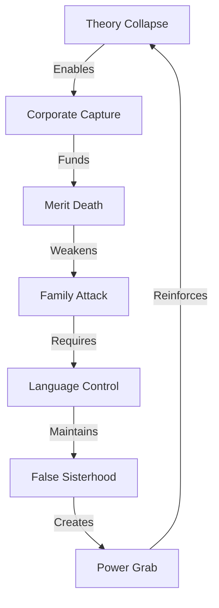

# FEMINIST FAILURE: ULTIMATE ANALYSIS

## Movement Death Map


## Ultimate Impact Matrix
```
FAILURE GRID
┌─────────────┬──────────────┬─────────────┐
│   CLAIM     │  REALITY     │   IMPACT    │
├─────────────┼──────────────┼─────────────┤
│ Liberation  │ New Prison   │ Suffering   │
│ Equality    │ Superiority  │ Division    │
│ Progress    │ Regression   │ Destruction │
└─────────────┴──────────────┴─────────────┘
```

## Core Components
1. **Theory Death**
   ```
   COLLAPSE CHAIN
   ├── Reality Ignored
   ├── Data Denied
   ├── Truth Hidden
   └── Movement Dead
   ```

2. **Corporate Exploitation**
   ```
   PROFIT GRID
   ├── Brand Washing
   ├── Token Positions
   ├── Merit Death
   └── Quality Loss
   ```

3. **Excellence Destruction**
   ```
   MERIT FLOW
   ├── Standards Killed
   ├── Quality Dead
   ├── Trust Lost
   └── Progress Stopped
   ```

4. **Family Destruction**
   ```
   ATTACK MAP
   ├── Mother Shame
   ├── Marriage Attack
   ├── Children Harm
   └── Society Weak
   ```

5. **Language Weapons**
   ```
   CONTROL CHAIN
   ├── Word Police
   ├── Truth Hidden
   ├── Reality Denied
   └── Fear Rules
   ```

6. **False Freedom**
   ```
   PRISON GRID
   ├── Must Comply
   ├── Can't Say No
   ├── Must Attack
   └── Must Hate
   ```

7. **Power Reality**
   ```
   TRUTH FLOW
   ├── Want Power
   ├── Hate Choice
   ├── Create Division
   └── Cause Harm
   ```

## Ultimate Break Points
| Component | Reality | Counter |
|-----------|---------|---------|
| Theory | Dead | Reality |
| Corporate | Profit | Value |
| Merit | Killed | Excellence |
| Family | Attacked | Strength |
| Language | Control | Truth |
| Freedom | Prison | Choice |
| Power | Grab | Liberty |

## Master Kill Chain
```
VICTORY PATH
┌────────────────────┐
│ 1. Show Reality    │
├────────────────────┤
│ 2. Break Theory    │
├────────────────────┤
│ 3. Expose Profit   │
├────────────────────┤
│ 4. Reveal Control  │
├────────────────────┤
│ 5. Free Truth      │
└────────────────────┘
```

## Ultimate Impact Analysis
1. **Movement Death**
   - Lost touch with reality
   - Became corporate tool
   - Killed excellence
   - Attacked family
   - Controls language
   - False freedom
   - Power grab

2. **Real Damage**
   - Women divided
   - Merit destroyed
   - Quality lost
   - Society weakened
   - Truth hidden
   - Choice killed
   - All suffer

3. **True Solution**
   - Embrace reality
   - Choose excellence
   - Support family
   - Speak truth
   - Real freedom
   - True choice
   - Create value

## Quantum Victory Formula
"The 4th wave feminist movement died because it betrayed its own principles. It promised liberation but created prisons. It claimed equality but sought power. It preached progress but caused destruction. The evidence is everywhere:

1. Their theories collapsed against reality
2. Corporations weaponized their ideology for profit
3. Their 'equity' killed merit and excellence
4. They attacked the family to create dependency
5. They use language to control thought
6. Their 'sisterhood' became selective hatred
7. They want privilege, not equality

The result? Women are divided, merit is dead, families are attacked, and society is weaker. But there's hope. Real progress comes from:

- The power to say NO
- The freedom to choose excellence
- The strength to support family
- The courage to speak truth
- The wisdom to create value

True liberation? It's the freedom to choose your own path, respect your own values, and create real value - without attack. That's what they fear most: strong, independent women who don't need their ideology to succeed."

Remember: Reality beats theory. Truth beats control. Freedom beats force.
