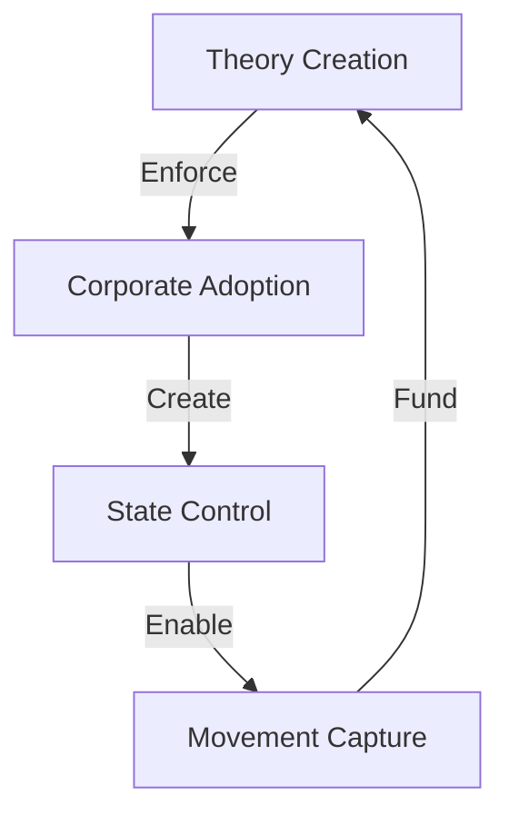

# FEMINIST FAILURE ANALYSIS

## Pattern Map


## Control Matrix
```
FAILURE GRID
┌─────────────┬─────────────┬─────────────┐
│   THEORY    │  REALITY    │   IMPACT    │
├─────────────┼─────────────┼─────────────┤
│ Academia    │ Real Women  │ Disconnect  │
│ Corporate   │ Real Issues │ Division    │
│ State       │ Real Life   │ Destruction │
└─────────────┴─────────────┴─────────────┘
```

## Core Components
1. **Theory Structure**
   ```
   FAILURE CHAIN
   ├── Academic Theory
   ├── Corporate Adoption
   ├── State Enforcement
   └── Movement Death
   ```

2. **Reality Gap**
   ```
   DISCONNECT GRID
   ├── Women's Issues
   ├── Real Problems
   ├── Actual Needs
   └── True Progress
   ```

3. **Impact Analysis**
   ```
   DAMAGE FLOW
   ├── Division Created
   ├── Progress Stopped
   ├── Issues Ignored
   └── Movement Killed
   ```

## Break Points
| Component | Weakness | Counter |
|-----------|----------|---------|
| Theory | Reality Gap | Results Focus |
| Corporate | Profit Motive | Value Creation |
| State | Force Need | Freedom Choice |

## Counter Strategy
```
BREAK CHAIN
┌────────────────────┐
│ 1. Show Reality    │
├────────────────────┤
│ 2. Create Value    │
├────────────────────┤
│ 3. Choose Freedom  │
└────────────────────┘
```

## Kill Chain
1. **Theory Break**
   ```
   REALITY CHAIN
   ├── Show Results
   ├── Expose Gap
   ├── Break Theory
   └── Win Truth
   ```

2. **Movement Break**
   ```
   FREEDOM PATH
   ├── Reality > Theory
   ├── Results > Control
   ├── Freedom > Force
   └── Truth > Narrative
   ```

## Victory Conditions
```
SUCCESS METRICS
┌─────────────────────┐
│ Reality Shown       │
│ Theory Broken       │
│ Value Created       │
│ Freedom Chosen      │
└─────────────────────┘
```

## Key Points
1. **Theory Failure**
   - Lost touch with real women
   - Ignored actual problems
   - Created division
   - Stopped progress

2. **Corporate Capture**
   - ESG exploitation
   - Virtue signaling
   - Profit over progress
   - Control mechanism

3. **State Control**
   - Force requirement
   - Regulation abuse
   - Freedom reduction
   - Progress prevention

## Quantum Kill Chain
"The 4th wave abandoned real women for academic theory, corporate profit, and state control. It doesn't liberate - it creates dependency. It doesn't unite - it divides. It doesn't solve problems - it creates new ones. The real feminist revolution? Creating actual value, solving real problems, and choosing freedom over force."

Remember: Reality always beats theory.
