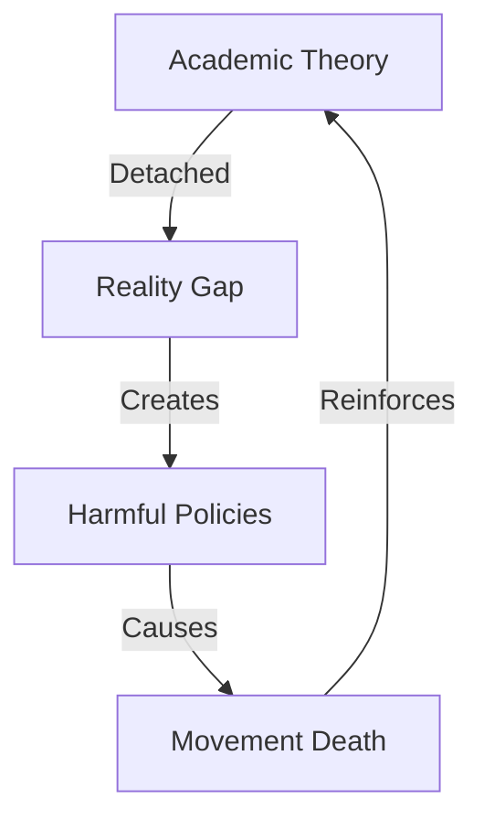

# THEORY COLLAPSE ANALYSIS

## Failure Map


## Reality Matrix
```
THEORY GRID
┌─────────────┬──────────────┬─────────────┐
│   CLAIM     │  REALITY     │   IMPACT    │
├─────────────┼──────────────┼─────────────┤
│ Patriarchy  │ Self-Harm    │ Division    │
│ Oppression  │ Victim Cult  │ Weakness    │
│ Liberation  │ New Chains   │ Failure     │
└─────────────┴──────────────┴─────────────┘
```

## Core Components
1. **Theory Failure**
   ```
   COLLAPSE CHAIN
   ├── Reality Disconnect
   ├── Data Ignorance
   ├── Logic Failure
   └── Result Blindness
   ```

2. **Academic Bubble**
   ```
   IVORY TOWER
   ├── Echo Chamber
   ├── Citation Circles
   ├── Reality Denial
   └── Truth Suppression
   ```

3. **Impact Analysis**
   ```
   DAMAGE FLOW
   ├── Women Harmed
   ├── Progress Stopped
   ├── Truth Hidden
   └── Movement Dead
   ```

## Break Points
| Theory | Reality | Impact |
|-----------|----------|---------|
| Patriarchy | Self-Sabotage | Division |
| Oppression | Victim Culture | Weakness |
| Liberation | New Control | Failure |

## Kill Chain
"Their theories collapsed because they ignored reality. They created problems instead of solving them. The movement died when it chose ideology over truth."

Remember: Reality always beats theory.
