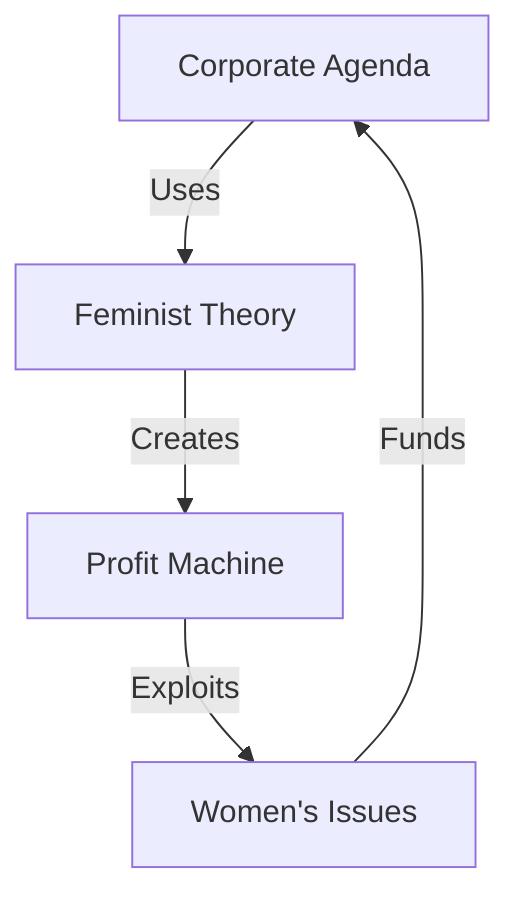

# CORPORATE FEMINISM ANALYSIS

## Exploitation Map


## Control Matrix
```
PROFIT GRID
┌─────────────┬──────────────┬─────────────┐
│   CLAIM     │  REALITY     │   IMPACT    │
├─────────────┼──────────────┼─────────────┤
│ Empowerment │ Exploitation │ Damage      │
│ Support     │ Profit Hunt  │ Division    │
│ Progress    │ Brand Games  │ Regression  │
└─────────────┴──────────────┴─────────────┘
```

## Core Components
1. **Corporate Capture**
   ```
   PROFIT CHAIN
   ├── ESG Exploitation
   ├── Brand Washing
   ├── Token Positions
   └── Fake Progress
   ```

2. **Marketing Machine**
   ```
   EXPLOITATION GRID
   ├── Pink Washing
   ├── Virtue Signaling
   ├── Empty Promises
   └── Real Harm
   ```

3. **True Cost**
   ```
   DAMAGE FLOW
   ├── Merit Death
   ├── Quality Loss
   ├── Trust Broken
   └── Progress Stopped
   ```

## Kill Chain
"Corporations weaponized feminism for profit while actually harming women. They sold empowerment but delivered exploitation. The result? Merit died, quality suffered, and real progress stopped."

Remember: Follow the money to find the truth.
