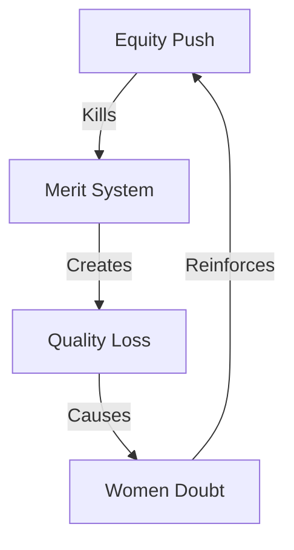

# MERIT DESTRUCTION ANALYSIS

## Damage Map


## Impact Matrix
```
MERIT GRID
┌─────────────┬──────────────┬─────────────┐
│   CLAIM     │  REALITY     │   IMPACT    │
├─────────────┼──────────────┼─────────────┤
│ Equity      │ Merit Death  │ Doubt       │
│ Inclusion   │ Quality Loss │ Weakness    │
│ Progress    │ Standards Die│ Failure     │
└─────────────┴──────────────┴─────────────┘
```

## Core Components
1. **Merit Death**
   ```
   DESTRUCTION CHAIN
   ├── Standards Killed
   ├── Quality Lost
   ├── Excellence Dead
   └── Progress Stopped
   ```

2. **Women's Loss**
   ```
   DAMAGE GRID
   ├── Achievement Doubt
   ├── Capability Question
   ├── Respect Loss
   └── Progress Death
   ```

3. **True Cost**
   ```
   IMPACT FLOW
   ├── Real Women Suffer
   ├── Quality Dies
   ├── Trust Lost
   └── Everyone Loses
   ```

## Kill Chain
"They killed merit in the name of equity. Now every woman's achievement is questioned. Real equality comes from excellence, not quotas. When standards die, everyone loses."

Remember: Excellence has no gender.
