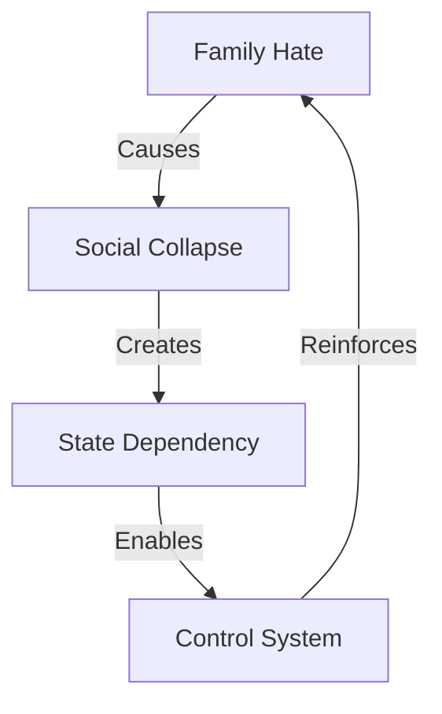

# FAMILY ATTACK ANALYSIS

## Destruction Map


## Impact Matrix
```
FAMILY GRID
┌─────────────┬──────────────┬─────────────┐
│   CLAIM     │  REALITY     │   IMPACT    │
├─────────────┼──────────────┼─────────────┤
│ Liberation  │ Isolation    │ Loneliness  │
│ Freedom     │ Dependency   │ Weakness    │
│ Progress    │ Destruction  │ Suffering   │
└─────────────┴──────────────┴─────────────┘
```

## Core Components
1. **Family Destruction**
   ```
   ATTACK CHAIN
   ├── Mother Shame
   ├── Marriage Attack
   ├── Children Harm
   └── Values Death
   ```

2. **Social Impact**
   ```
   DAMAGE GRID
   ├── Community Loss
   ├── Support Death
   ├── Identity Crisis
   └── Purpose Loss
   ```

3. **True Cost**
   ```
   IMPACT FLOW
   ├── Women Isolated
   ├── Children Hurt
   ├── Society Broken
   └── All Suffer
   ```

## Kill Chain
"They attacked the family to create dependency. Result? Isolated women, broken communities, and a weaker society. Strong families mean strong women - that's what they fear."

Remember: Family is freedom, not oppression.
