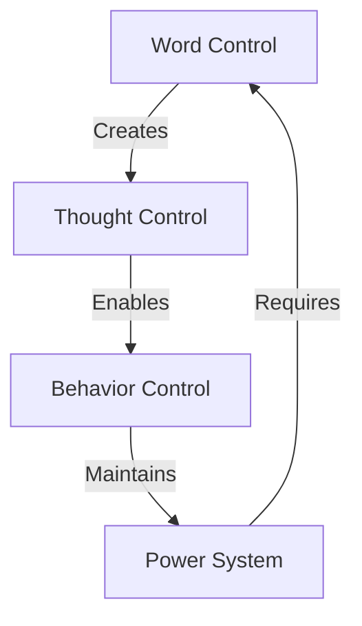

# LANGUAGE CONTROL ANALYSIS

## Control Map


## Impact Matrix
```
CONTROL GRID
┌─────────────┬──────────────┬─────────────┐
│   CLAIM     │  REALITY     │   IMPACT    │
├─────────────┼──────────────┼─────────────┤
│ Inclusion   │ Division     │ Confusion   │
│ Respect     │ Control      │ Fear        │
│ Progress    │ Regression   │ Silence     │
└─────────────┴──────────────┴─────────────┘
```

## Core Components
1. **Language Weapons**
   ```
   CONTROL CHAIN
   ├── Word Police
   ├── Thought Crime
   ├── Speech Fear
   └── Truth Death
   ```

2. **Control Impact**
   ```
   DAMAGE GRID
   ├── Clear Speech Dead
   ├── Truth Hidden
   ├── Reality Denied
   └── Progress Stopped
   ```

3. **True Cost**
   ```
   IMPACT FLOW
   ├── Communication Dies
   ├── Fear Rules
   ├── Truth Hides
   └── All Lose
   ```

## Kill Chain
"They control language to control thought. 'Inclusive' language excludes reality. When words lose meaning, truth dies. Clear speech is true progress."

Remember: Truth needs clear language.
