# FALSE EMPOWERMENT ANALYSIS

## Hypocrisy Map

```mermaid
graph TD
    A[Selective Sisterhood] -->|Attack| B[Traditional Women]
    B -->|Label| C[Internalized Misogyny]
    C -->|Suppress| D[Real Choice]
    D -->|Maintain| A
```


## Control Matrix
```
FREEDOM GRID
┌─────────────┬──────────────┬─────────────┐
│ THEIR CLAIM │  REALITY     │   TRUTH     │
├─────────────┼──────────────┼─────────────┤
│ Liberation  │ New Prison   │ True Choice │
│ Sisterhood  │ Hate Group   │ Respect All │
│ Freedom     │ Control      │ Say No      │
└─────────────┴──────────────┴─────────────┘
```

## Core Components
1. **False Sisterhood**
   ```
   EXCLUSION CHAIN
   ├── Attack Traditionalists
   ├── Mock Stay-at-home Moms
   ├── Shame Conservative Women
   └── Hate Pro-life Views
   ```

2. **Freedom Paradox**
   ```
   CONTROL GRID
   ├── Must Sleep Around
   ├── Must Hate Family
   ├── Must Abort
   └── Must Comply
   ```

3. **True Freedom**
   ```
   CHOICE FLOW
   ├── Power to Say No
   ├── Respect Own Body
   ├── Choose Values
   └── Accept Others
   ```

## Break Points
| Claim | Reality | Counter |
|-----------|----------|---------|
| Sisterhood | Selective Hate | Universal Respect |
| Liberation | New Prison | True Choice |
| Empowerment | Degradation | Self-Respect |

## Counter Strategy
```
TRUTH CHAIN
┌────────────────────┐
│ 1. Real Choice     │
├────────────────────┤
│ 2. Body Respect    │
├────────────────────┤
│ 3. Value Freedom   │
└────────────────────┘
```

## Kill Chain
1. **Expose Hypocrisy**
   ```
   REALITY CHAIN
   ├── Show Hate
   ├── Expose Control
   ├── Reveal Prison
   └── Break Narrative
   ```

2. **True Liberation**
   ```
   FREEDOM PATH
   ├── Choose Freely
   ├── Respect All
   ├── Support Choice
   └── Build Up
   ```

## Key Points
1. **False Sisterhood**
   - Only supports their ideology
   - Attacks different views
   - Hates traditional women
   - Mocks real choices

2. **Control Mechanism**
   - Must follow their rules
   - Must accept their lifestyle
   - Must hate tradition
   - Must comply or be attacked

3. **Real Freedom Is**
   - Power to say NO
   - Respect for all choices
   - Support for all women
   - True body autonomy

## Quantum Kill Chain
"Their 'sisterhood' is the most anti-woman movement. True freedom includes the power to say NO. Real empowerment is respecting your own body and choices. The greatest liberation? Being able to choose tradition, modesty, or career without attack. They've replaced patriarchal control with ideological prison - and call it freedom."

Remember: True freedom includes the freedom to say no.
