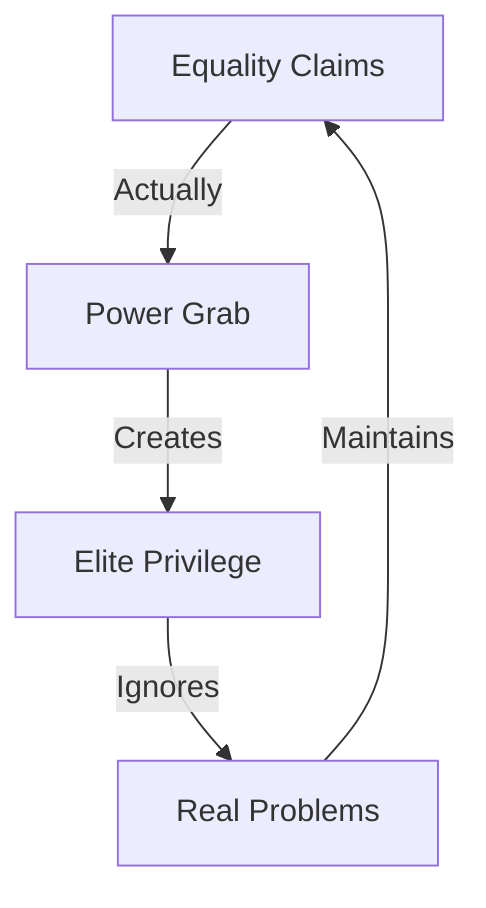

# POWER PRIVILEGE ANALYSIS

## Deception Map


## Reality Matrix
```
PRIVILEGE GRID
┌─────────────┬──────────────┬─────────────┐
│   CLAIM     │  REALITY     │   IMPACT    │
├─────────────┼──────────────┼─────────────┤
│ Equality    │ Superiority  │ Division    │
│ Protection  │ Elite Power  │ Suffering   │
│ Progress    │ Regression   │ Poverty     │
└─────────────┴──────────────┴─────────────┘
```

## Core Components
1. **False Ministry**
   ```
   WASTE CHAIN
   ├── Huge Budgets
   ├── Zero Results
   ├── Elite Benefits
   └── Women Suffer
   ```

2. **Real Problems**
   ```
   IMPACT GRID
   ├── Inflation
   ├── Economic Crisis
   ├── Real Violence
   └── Daily Struggles
   ```

3. **True Solutions**
   ```
   FREEDOM FLOW
   ├── Economic Liberty
   ├── Less Government
   ├── Real Security
   └── Actual Progress
   ```

## Break Points
| Narrative | Reality | Impact |
|-----------|----------|---------|
| Ministry Help | Budget Waste | More Poverty |
| Gender Laws | Elite Power | Common Suffering |
| Quotas | Merit Death | Economic Damage |

## Counter Strategy
```
TRUTH CHAIN
┌────────────────────┐
│ 1. Show Numbers    │
├────────────────────┤
│ 2. Expose Waste    │
├────────────────────┤
│ 3. Real Solutions  │
└────────────────────┘
```

## Kill Chain
1. **Economic Reality**
   ```
   DAMAGE FLOW
   ├── Show Inflation Impact
   ├── Expose Ministry Waste
   ├── Reveal Elite Privilege
   └── Demonstrate Real Harm
   ```

2. **True Progress**
   ```
   SOLUTION PATH
   ├── Economic Freedom
   ├── Security Focus
   ├── Merit Based
   └── Real Results
   ```

## Key Points
1. **Power Not Equality**
   - Seek superiority not equality
   - Want privilege not fairness
   - Demand power not progress
   - Elite benefits vs common good

2. **Economic Reality**
   - Inflation hurts all women
   - Ministry wastes resources
   - Quotas kill merit
   - Policies increase poverty

3. **Real Solutions**
   - Economic freedom helps all
   - Security benefits everyone
   - Merit creates opportunity
   - Less government, more progress

## Quantum Kill Chain
"The Women's Ministry was a perfect example: massive budgets, zero results. While they created privilege for a few elites, inflation destroyed women's savings. Real progress came from economic freedom and security - exactly what Milei delivered. They don't want equality - they want power. They don't solve problems - they create new ones."

Remember: Real progress comes from freedom, not control.
