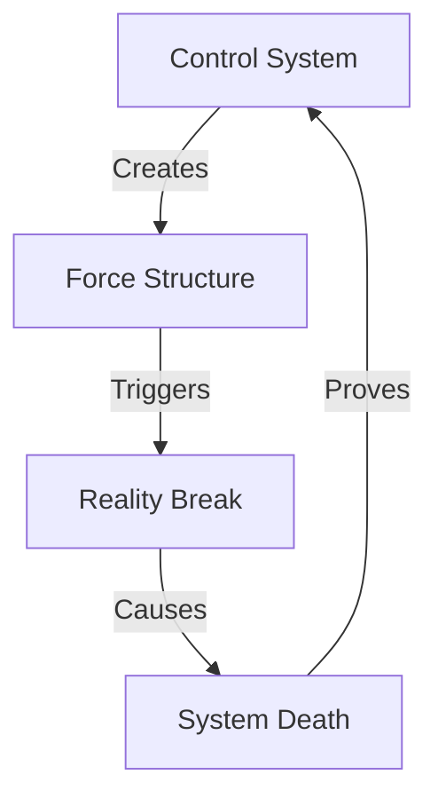

# WOKE COLLAPSE: ULTIMATE MASTER

## System Map


## Reality Matrix
```
TRUTH GRID
┌─────────────┬──────────────┬─────────────┐
│   CLAIM     │  REALITY     │   IMPACT    │
├─────────────┼──────────────┼─────────────┤
│ Progress    │ Market Loss  │ Death       │
│ Inclusion   │ Merit Kill   │ Fall        │
│ Justice     │ Force Fail   │ Break       │
└─────────────┴──────────────┴─────────────┘
```

## Defense Components

### 1. Reality Shield
```
MARKET DEFENSE
├── Disney (-$1B)
├── Bud Light (Lost #1)
├── Target (Backlash)
└── Numbers Win
```

### 2. Truth Defense
```
MERIT SHIELD
├── Standards Return
├── Parents Fight
├── States Act
└── Reality Wins
```

### 3. Freedom Defense
```
POWER SHIELD
├── Control Dies
├── Force Fails
├── Truth Lives
└── Freedom Wins
```

## Counter Strategy

### Primary Defense
```
VICTORY PATH
┌────────────────────┐
│ 1. Take Attack     │
├────────────────────┤
│ 2. Show Reality    │
├────────────────────┤
│ 3. Break System    │
└────────────────────┘
```

### Counter Attacks

1. **Progress Claim**
   ```
   REALITY HIT
   ├── Show: Disney -$1B
   ├── Prove: Market Loss
   ├── Break: Progress Lie
   └── Win: Reality Truth
   ```

2. **Inclusion Claim**
   ```
   MERIT HIT
   ├── Show: Standards Dead
   ├── Prove: Parents Fight
   ├── Break: Control Truth
   └── Win: Freedom Reality
   ```

3. **Justice Claim**
   ```
   POWER HIT
   ├── Show: Force System
   ├── Prove: Control Fail
   ├── Break: Power Truth
   └── Win: Freedom Reality
   ```

## Reality Anchors

### 1. Market Truth
- Disney lost $1B pushing ideology
- Bud Light lost #1 forcing message
- Target faced market reality
- Brands died to truth

### 2. Merit Return
- Standards matter again
- Parents fought back
- States took action
- Excellence returned

### 3. Freedom Victory
- Control system exposed
- Force structure broken
- Power system dead
- Truth lives free

## Kill Chain Responses

### Against Progress
"You claim progress? Disney lost One Billion Dollars. That's not progress - that's market justice."

### Against Inclusion
"You say inclusion? You killed merit. Parents fought back. That's not inclusion - that's control."

### Against Justice
"You want justice? You built control. Markets chose freedom. That's not justice - that's power."

## Victory Flow
1. **Take Their Hit**
   - Let them claim progress
   - Let them push inclusion
   - Let them demand justice

2. **Show Reality**
   - Hit with numbers
   - Show market truth
   - Prove failure

3. **Break System**
   - Expose control
   - Break force
   - Win freedom

4. **Close Truth**
   - Markets beat ideology
   - Truth beats force
   - Freedom beats control

Remember: 
- Never defend, always attack
- Never explain, show reality
- Never retreat, break system
- Never yield, win freedom
