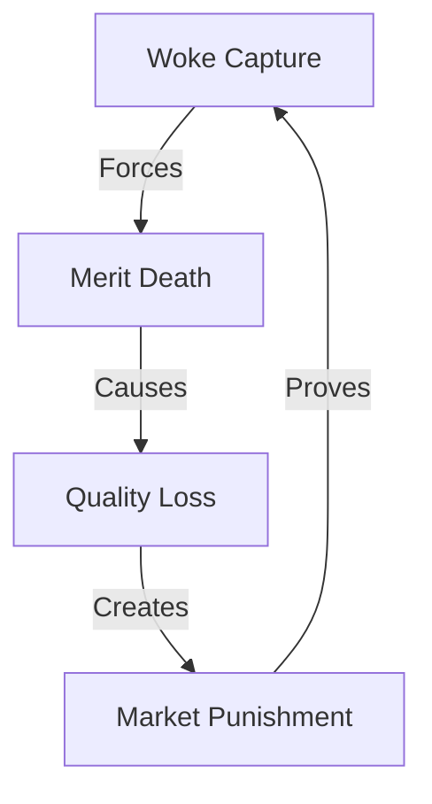

# CORPORATE COLLAPSE ANALYSIS

## Control Map


## Impact Matrix
```
FAILURE GRID
┌─────────────┬──────────────┬─────────────┐
│   CLAIM     │  REALITY     │   IMPACT    │
├─────────────┼──────────────┼─────────────┤
│ Inclusion   │ Exclusion    │ Merit Death │
│ Progress    │ Regression   │ Value Loss  │
│ Justice     │ New Control  │ Brand Death │
└─────────────┴──────────────┴─────────────┘
```

## Core Components
1. **Corporate Death**
   ```
   FAILURE CHAIN
   ├── Disney (-$1B Loss)
   ├── Bud Light (Lost #1)
   ├── Target (Backlash)
   └── Brand Collapse
   ```

2. **Control Reality**
   ```
   TRUTH GRID
   ├── Merit Killed
   ├── Quality Lost
   ├── Value Destroyed
   └── Market Punished
   ```

3. **System Exposure**
   ```
   CONTROL FLOW
   ├── Force Quotas
   ├── Kill Excellence
   ├── Push Ideology
   └── Face Reality
   ```

## Break Points
| Company | Reality | Impact |
|-----------|---------|---------|
| Disney | -$1B Loss | Brand Death |
| Bud Light | Lost #1 | Market Fall |
| Target | Backlash | Value Loss |

## Counter Strategy
```
VICTORY PATH
┌────────────────────┐
│ 1. Show Numbers    │
├────────────────────┤
│ 2. Expose Control  │
├────────────────────┤
│ 3. Prove Market    │
└────────────────────┘
```

## Reality Anchors
1. **Corporate Evidence**
   - Walmart pulling back DEI
   - Ford ending quotas
   - Harley-Davidson reversing
   - John Deere stopping programs

2. **Market Truth**
   - Quality over quota
   - Merit over messaging
   - Value over virtue
   - Results over rhetoric

3. **System Death**
   - DEI departments merged
   - Diversity positions cut
   - Quotas eliminated
   - Reality returned

## Kill Chain
"They claimed inclusion but created exclusion. They promised progress but killed merit. The market responded: Disney lost $1B, Bud Light lost its crown, Target faced reality. When you force ideology over excellence, the market punishes you. That's not social justice - that's market justice."

Remember: Markets don't care about your feelings.
