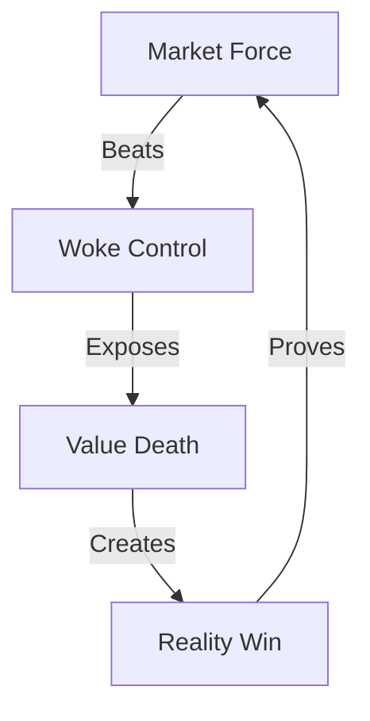

# MARKET REALITY ANALYSIS

## Truth Map


## Impact Matrix
```
REALITY GRID
┌─────────────┬──────────────┬─────────────┐
│   CLAIM     │  REALITY     │   IMPACT    │
├─────────────┼──────────────┼─────────────┤
│ Progress    │ Value Loss   │ Market Fall │
│ Inclusion   │ Merit Death  │ Brand Loss  │
│ Justice     │ Control Fail │ Total End   │
└─────────────┴──────────────┴─────────────┘
```

## Core Components
1. **Market Victory**
   ```
   TRUTH CHAIN
   ├── ESG Collapse
   ├── State Pullback
   ├── Consumer Power
   └── Reality Win
   ```

2. **Value Return**
   ```
   MERIT GRID
   ├── Quality Focus
   ├── Excellence Return
   ├── Results Matter
   └── Truth Wins
   ```

3. **Control Break**
   ```
   FREEDOM FLOW
   ├── Force Fails
   ├── Control Dies
   ├── Market Wins
   └── Truth Lives
   ```

## Break Points
| Force | Reality | Impact |
|-----------|---------|---------|
| ESG | Collapse | Freedom |
| DEI | Cuts | Merit |
| Control | Fail | Truth |

## Counter Strategy
```
VICTORY PATH
┌────────────────────┐
│ 1. Show Value Loss │
├────────────────────┤
│ 2. Prove Market    │
├────────────────────┤
│ 3. Win Freedom    │
└────────────────────┘
```

## Reality Anchors
1. **Market Evidence**
   - Vanguard leaving climate initiatives
   - States pulling ESG business
   - DEI rankings abandoned
   - Merit returning

2. **Value Truth**
   - Performance over politics
   - Results over rhetoric
   - Excellence over ideology
   - Truth over control

3. **Freedom Victory**
   - Force fails
   - Market wins
   - Truth returns
   - Freedom lives

## Kill Chain
"They thought they could force ideology over value. The market proved them wrong. When Vanguard left, when states pulled out, when consumers spoke - reality won. You can't control markets, you can't force value, you can't fake excellence. The market always finds truth."

Remember: Markets beat ideology every time.
