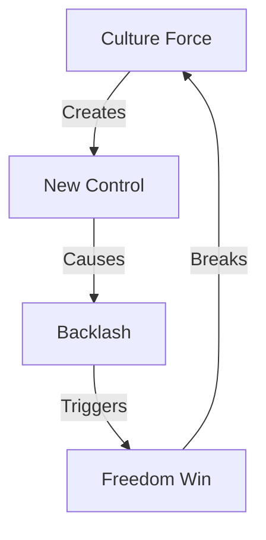

# CULTURE SHIFT ANALYSIS

## Control Map


## Impact Matrix
```
CULTURE GRID
┌─────────────┬──────────────┬─────────────┐
│   CLAIM     │  REALITY     │   IMPACT    │
├─────────────┼──────────────┼─────────────┤
│ Diversity   │ New Control  │ Division    │
│ Tolerance   │ Force System │ Resistance  │
│ Unity       │ Separation   │ Freedom Win │
└─────────────┴──────────────┴─────────────┘
```

## Core Components
1. **Control System**
   ```
   FORCE CHAIN
   ├── Language Police
   ├── Thought Control
   ├── Merit Death
   └── Freedom Kill
   ```

2. **Reality Break**
   ```
   TRUTH GRID
   ├── Public Rejection
   ├── Consumer Power
   ├── Culture Shift
   └── Freedom Return
   ```

3. **Victory Path**
   ```
   WIN FLOW
   ├── Force Fails
   ├── Truth Wins
   ├── People Choose
   └── Freedom Lives
   ```

## Break Points
| Control | Reality | Impact |
|-----------|---------|---------|
| Language | Rejected | Freedom |
| Thought | Resisted | Truth |
| Force | Failed | Victory |

## Counter Strategy
```
VICTORY PATH
┌────────────────────┐
│ 1. Expose Control  │
├────────────────────┤
│ 2. Show Reality    │
├────────────────────┤
│ 3. Win Freedom    │
└────────────────────┘
```

## Reality Anchors
1. **Control Evidence**
   - Forced language changes
   - Mandatory trainings
   - Thought policing
   - Merit destruction

2. **Freedom Response**
   - Public rejection
   - Consumer power
   - Culture shift
   - Truth return

3. **Victory Signs**
   - Control failing
   - Truth winning
   - Freedom rising
   - Reality returning

## Kill Chain
"They claimed diversity but created division. They preached tolerance but practiced control. When you force ideology on culture, culture fights back. That's not progress - that's control. And control always loses to freedom."

Remember: Freedom beats force every time.
