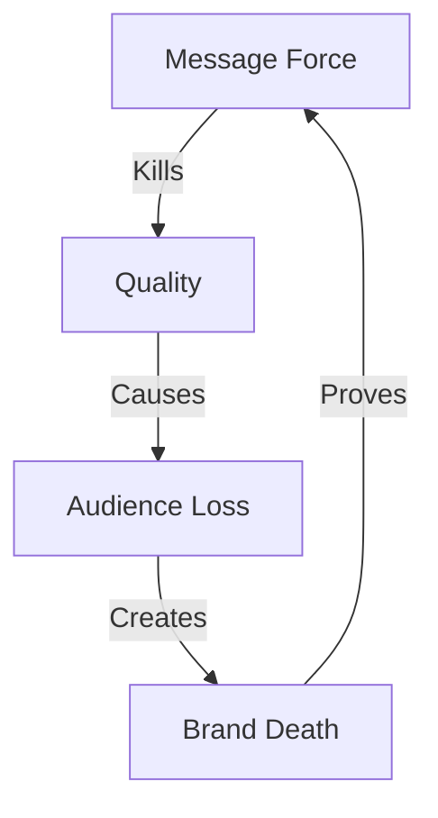

# ENTERTAINMENT DEATH ANALYSIS

## Failure Map


## Impact Matrix
```
MEDIA GRID
┌─────────────┬──────────────┬─────────────┐
│   CLAIM     │  REALITY     │   IMPACT    │
├─────────────┼──────────────┼─────────────┤
│ Stories     │ Propaganda   │ Quality Die │
│ Art         │ Messaging    │ Views Drop  │
│ Culture     │ Control      │ Brand Fall  │
└─────────────┴──────────────┴─────────────┘
```

## Core Components
1. **Disney Death**
   ```
   LOSS CHAIN
   ├── $1B Lost
   ├── Quality Dead
   ├── Audience Gone
   └── Brand Broken
   ```

2. **Quality Kill**
   ```
   DEATH GRID
   ├── Story Dead
   ├── Art Gone
   ├── Truth Lost
   └── Value Dead
   ```

3. **Audience Response**
   ```
   REALITY FLOW
   ├── Views Drop
   ├── Money Lost
   ├── Brand Dies
   └── Truth Wins
   ```

## Break Points
| Content | Reality | Impact |
|-----------|---------|---------|
| Story | Dead | Loss |
| Quality | Gone | Fall |
| Brand | Broken | End |

## Counter Strategy
```
VICTORY PATH
┌────────────────────┐
│ 1. Show Numbers    │
├────────────────────┤
│ 2. Expose Death    │
├────────────────────┤
│ 3. Prove Market    │
└────────────────────┘
```

## Reality Anchors
1. **Disney Evidence**
   - $1B lost in failures
   - Quality collapse
   - Audience exodus
   - Brand damage

2. **Market Truth**
   - Story beats message
   - Quality beats quota
   - Art beats agenda
   - Truth beats control

3. **Death Signs**
   - Views dropping
   - Money losing
   - Brands dying
   - Reality winning

## Kill Chain
"Disney lost $1B because they chose message over story, agenda over art, control over quality. When you force ideology into entertainment, you kill entertainment. That's not art - that's propaganda. And propaganda always loses to truth."

Remember: Story beats message, quality beats quota.
