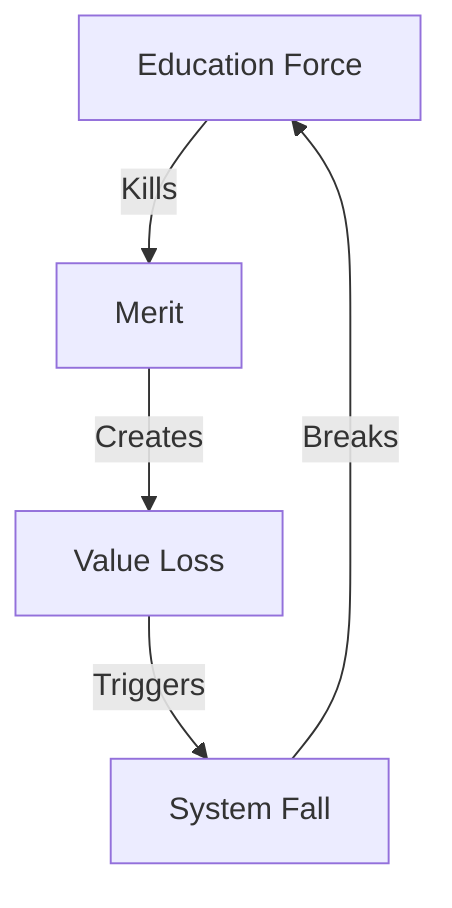

# EDUCATION COLLAPSE ANALYSIS

## Control Map


## Impact Matrix
```
EDUCATION GRID
┌─────────────┬──────────────┬─────────────┐
│   CLAIM     │  REALITY     │   IMPACT    │
├─────────────┼──────────────┼─────────────┤
│ Learning    │ Control      │ Merit Die   │
│ Growth      │ Force        │ Value Loss  │
│ Progress    │ Ideology     │ Truth Win   │
└─────────────┴──────────────┴─────────────┘
```

## Core Components
1. **Merit Death**
   ```
   KILL CHAIN
   ├── Standards Gone
   ├── Quality Dead
   ├── Value Lost
   └── Truth Dead
   ```

2. **System Response**
   ```
   REALITY GRID
   ├── Parents Fight
   ├── States Act
   ├── Laws Change
   └── Truth Returns
   ```

3. **Freedom Victory**
   ```
   WIN FLOW
   ├── Control Dies
   ├── Merit Returns
   ├── Value Lives
   └── Truth Wins
   ```

## Break Points
| System | Reality | Impact |
|-----------|---------|---------|
| Standards | Gone | Loss |
| Merit | Dead | Fall |
| Truth | Return | Win |

## Counter Strategy
```
VICTORY PATH
┌────────────────────┐
│ 1. Show Control    │
├────────────────────┤
│ 2. Expose Death    │
├────────────────────┤
│ 3. Prove Freedom   │
└────────────────────┘
```

## Reality Anchors
1. **System Evidence**
   - Standards dropping
   - Merit dying
   - Parents fighting
   - States acting

2. **Truth Return**
   - Merit matters
   - Quality counts
   - Value wins
   - Truth lives

3. **Victory Signs**
   - Laws changing
   - Parents winning
   - Freedom rising
   - Truth returning

## Kill Chain
"They killed merit in the name of equity. They destroyed standards in the name of inclusion. When you force ideology into education, you kill education. That's not progress - that's control. And parents are fighting back."

Remember: Merit beats ideology, truth beats control.
