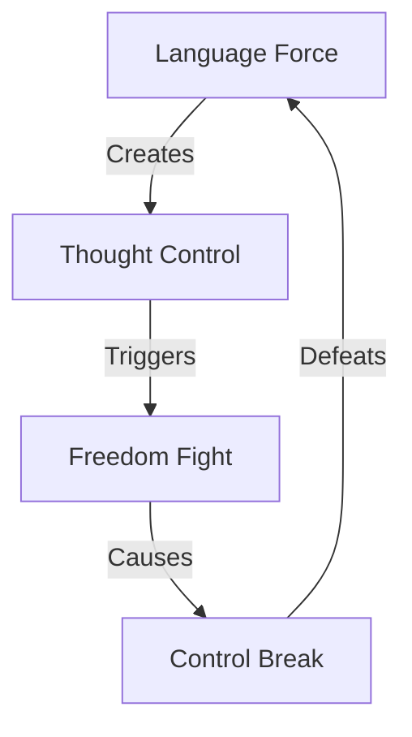

# LANGUAGE CONTROL ANALYSIS

## Control Map


## Impact Matrix
```
LANGUAGE GRID
┌─────────────┬──────────────┬─────────────┐
│   CLAIM     │  REALITY     │   IMPACT    │
├─────────────┼──────────────┼─────────────┤
│ Inclusion   │ Control      │ Truth Die   │
│ Respect     │ Force        │ Speech Kill │
│ Progress    │ Power        │ Fight Back  │
└─────────────┴──────────────┴─────────────┘
```

## Core Components
1. **Control System**
   ```
   FORCE CHAIN
   ├── Word Police
   ├── Speech Control
   ├── Thought Force
   └── Truth Kill
   ```

2. **Freedom Response**
   ```
   TRUTH GRID
   ├── People Resist
   ├── Speech Lives
   ├── Truth Wins
   └── Force Dies
   ```

3. **Victory Path**
   ```
   WIN FLOW
   ├── Control Fails
   ├── Truth Returns
   ├── Speech Lives
   └── Freedom Wins
   ```

## Break Points
| Control | Reality | Impact |
|-----------|---------|---------|
| Words | Resist | Free |
| Speech | Fight | Win |
| Truth | Live | Victory |

## Counter Strategy
```
VICTORY PATH
┌────────────────────┐
│ 1. Show Control    │
├────────────────────┤
│ 2. Expose Force    │
├────────────────────┤
│ 3. Win Freedom    │
└────────────────────┘
```

## Reality Anchors
1. **Control Evidence**
   - Word policing
   - Speech codes
   - Thought control
   - Truth death

2. **Freedom Fight**
   - People resist
   - Speech lives
   - Truth wins
   - Force fails

3. **Victory Signs**
   - Control breaking
   - Truth returning
   - Speech living
   - Freedom winning

## Kill Chain
"They claimed inclusion but created control. They said respect but meant force. When you control language, you control thought. That's not progress - that's power. And power always loses to freedom."

Remember: Truth beats control, freedom beats force.
