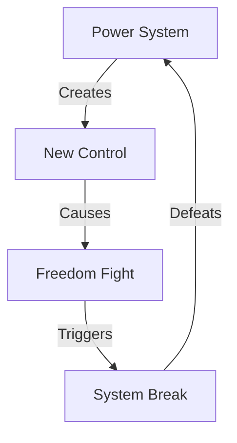

# POWER SYSTEM ANALYSIS

## Control Map


## Impact Matrix
```
POWER GRID
┌─────────────┬──────────────┬─────────────┐
│   CLAIM     │  REALITY     │   IMPACT    │
├─────────────┼──────────────┼─────────────┤
│ Justice     │ Control      │ Force Die   │
│ Equity      │ Power        │ Truth Win   │
│ Progress    │ System       │ Freedom Live│
└─────────────┴──────────────┴─────────────┘
```

## Core Components
1. **System Exposure**
   ```
   TRUTH CHAIN
   ├── Control Show
   ├── Power Reveal
   ├── Force Expose
   └── Truth Win
   ```

2. **Freedom Fight**
   ```
   WIN GRID
   ├── People Rise
   ├── Truth Lives
   ├── Force Dies
   └── Freedom Wins
   ```

3. **Victory Path**
   ```
   REALITY FLOW
   ├── System Break
   ├── Truth Return
   ├── Freedom Live
   └── Power Die
   ```

## Break Points
| System | Reality | Impact |
|-----------|---------|---------|
| Control | Break | Free |
| Power | Fall | Win |
| Force | Die | Victory |

## Counter Strategy
```
VICTORY PATH
┌────────────────────┐
│ 1. Show System     │
├────────────────────┤
│ 2. Expose Control  │
├────────────────────┤
│ 3. Win Freedom    │
└────────────────────┘
```

## Reality Anchors
1. **System Evidence**
   - Control exposed
   - Power revealed
   - Force shown
   - Truth winning

2. **Freedom Fight**
   - People rising
   - Truth living
   - Force dying
   - Freedom winning

3. **Victory Signs**
   - System breaking
   - Truth returning
   - Freedom living
   - Power dying

## Kill Chain
"They claimed justice but created control. They said equity but meant power. When you build a system of control, you create resistance. That's not progress - that's power. And power always falls to freedom."

Remember: Freedom beats power, truth beats control.
