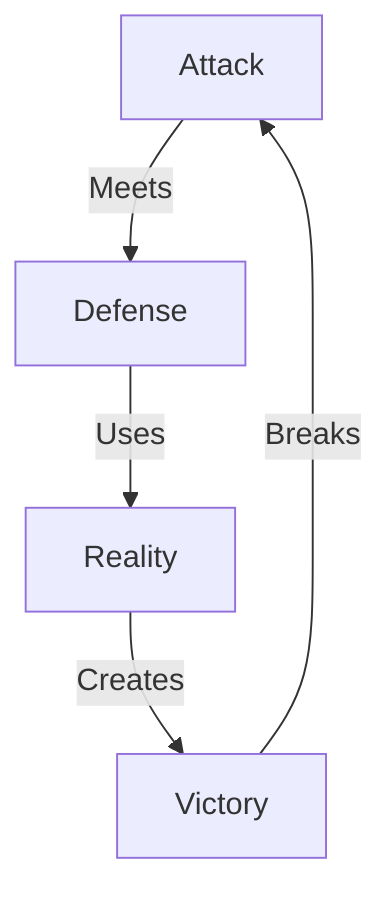

# WOKE COLLAPSE: DEFENSE MASTER

## Shield Grid


## Defense Matrix
```
SHIELD GRID
┌─────────────┬──────────────┬─────────────┐
│   ATTACK    │  DEFENSE     │   VICTORY   │
├─────────────┼──────────────┼─────────────┤
│ Progress    │ Market Loss  │ Truth Win   │
│ Inclusion   │ Merit Return │ Force Die   │
│ Justice     │ Power Break  │ Freedom Win │
└─────────────┴──────────────┴─────────────┘
```

## Core Defenses

### 1. Market Shield
```
REALITY DEFENSE
├── Disney Loss (-$1B)
├── Bud Light Fall (#1)
├── Target Hit (Brand)
└── Numbers Win (Truth)
```

### 2. Merit Shield
```
TRUTH DEFENSE
├── Standards Matter
├── Parents Fight
├── States Act
└── Excellence Lives
```

### 3. Power Shield
```
FREEDOM DEFENSE
├── Control Dies
├── Force Fails
├── Truth Lives
└── Freedom Wins
```

## Counter Tactics

### Against Progress
```
MARKET DEFENSE
├── Take: "We need progress"
├── Hit: "Disney lost $1B"
├── Break: "That's failure"
└── Win: "Market justice"
```

### Against Inclusion
```
MERIT DEFENSE
├── Take: "We need equity"
├── Hit: "Merit died"
├── Break: "Parents fought"
└── Win: "Truth lives"
```

### Against Justice
```
POWER DEFENSE
├── Take: "We need justice"
├── Hit: "You want control"
├── Break: "Force fails"
└── Win: "Freedom wins"
```

## Reality Counters

### 1. Market Truth
- When they say "Progress"
  - Show Disney's $1B loss
  - Prove market reality
  - Break ideology

### 2. Merit Reality
- When they say "Inclusion"
  - Show standards death
  - Prove parent fight
  - Break control

### 3. Power Break
- When they say "Justice"
  - Show force system
  - Prove power fail
  - Break control

## Defense Flows

### 1. Market Defense
```
VICTORY PATH
┌────────────────────┐
│ 1. Take Progress   │
├────────────────────┤
│ 2. Show Loss       │
├────────────────────┤
│ 3. Break System    │
└────────────────────┘
```

### 2. Merit Defense
```
VICTORY PATH
┌────────────────────┐
│ 1. Take Inclusion  │
├────────────────────┤
│ 2. Show Death      │
├────────────────────┤
│ 3. Break Control   │
└────────────────────┘
```

### 3. Power Defense
```
VICTORY PATH
┌────────────────────┐
│ 1. Take Justice    │
├────────────────────┤
│ 2. Show Force      │
├────────────────────┤
│ 3. Break Power     │
└────────────────────┘
```

## Kill Chain Examples

### Progress Break
"You claim progress? Disney lost One Billion Dollars. That's not progress - that's market justice."

### Inclusion Break
"You say inclusion? You killed merit. Parents fought back. That's not inclusion - that's control."

### Justice Break
"You want justice? You built control. Markets chose freedom. That's not justice - that's power."

## Victory Notes
1. Never defend - counter attack
2. Never explain - show reality
3. Never yield - win freedom
4. Always hit truth
5. Always break system

Remember:
- Let them attack
- Hit with reality
- Break with truth
- Win with freedom
