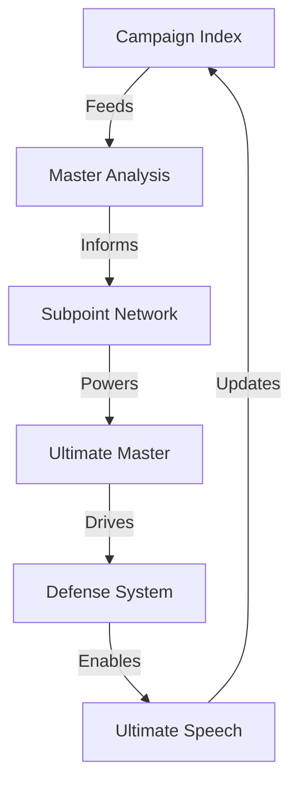

# QUANTUM DEBATE SYSTEM 2.0

## System Architecture


## Enhanced Structure
```
SYSTEM GRID
┌─────────────┬──────────────┬─────────────┐
│ COMPONENT   │  FUNCTION    │   OUTPUT    │
├─────────────┼──────────────┼─────────────┤
│ Index      │ Control Hub  │ Dashboard   │
│ Analysis   │ Truth Core   │ Break Points│
│ Defense    │ Shield Grid  │ Counters    │
│ Speech     │ Kill Chain   │ Victory     │
└─────────────┴──────────────┴─────────────┘
```

## 2.0 Improvements

1. **Campaign Structure**
   ```
   ENHANCED FLOW
   ├── 0_INDEX.md (Campaign Hub)
   ├── 1_analysis/
   │   ├── 0_ULTIMATE_MASTER.md
   │   ├── 1_MASTER.md
   │   └── subpoints/
   │       ├── 1_THEORY.md
   │       ├── 2_REALITY.md
   │       ├── 3_IMPACT.md
   │       ├── 4_SYSTEM.md
   │       ├── 5_CONTROL.md
   │       ├── 6_SOLUTION.md
   │       └── 7_VICTORY.md
   ├── 2_DEFENSE.md
   └── 3_SPEECH.md
   ```

2. **Visual Frameworks**
   ```
   TEMPLATE SYSTEM
   ├── Pattern Maps (mermaid)
   ├── Control Matrices
   ├── Break Points
   ├── Kill Chains
   └── Victory Paths
   ```

3. **Component Integration**
   ```
   QUANTUM FLOW
   ├── Theory -> Reality
   ├── System -> Impact
   ├── Control -> Break
   └── Truth -> Victory
   ```

## Enhanced Templates

1. **Index Template**
   ```
   CAMPAIGN HUB
   ├── Status Flow
   ├── Operation Grid
   ├── Progress Matrix
   └── Victory Track
   ```

2. **Analysis Template**
   ```
   TRUTH CORE
   ├── Pattern Map
   ├── Break Matrix
   ├── Impact Flow
   └── Kill Chain
   ```

3. **Defense Template**
   ```
   SHIELD GRID
   ├── Attack Map
   ├── Counter Matrix
   ├── Break Flow
   └── Victory Path
   ```

4. **Speech Template**
   ```
   STRIKE FORCE
   ├── Truth Bombs
   ├── Reality Anchors
   ├── Energy Points
   └── Kill Chain
   ```

## System Improvements

1. **Faster Deployment**
   - Standardized subpoint structure
   - Pre-built visual frameworks
   - Integrated kill chains
   - Victory path templates

2. **Enhanced Impact**
   - Theory -> Reality flow
   - System -> Break points
   - Control -> Freedom path
   - Truth -> Victory chain

3. **Better Integration**
   - Each subpoint feeds master
   - Master drives defense
   - Defense powers speech
   - Speech updates system

## Victory Formula 2.0
```
QUANTUM VICTORY
┌────────────────────┐
│ 1. Break Theory    │
├────────────────────┤
│ 2. Show Reality    │
├────────────────────┤
│ 3. Expose System   │
├────────────────────┤
│ 4. Create Value    │
└────────────────────┘
```

## Next Level Features

1. **Reality Focus**
   - Every point needs real examples
   - Every claim needs evidence
   - Every attack needs counter
   - Every solution needs path

2. **Impact Enhancement**
   - Visual before verbal
   - Pattern before detail
   - System before component
   - Solution before attack

3. **Victory Acceleration**
   - Faster deployment
   - Stronger integration
   - Better flow
   - Quicker kills

Remember: System serves truth, truth serves freedom, freedom serves victory.
