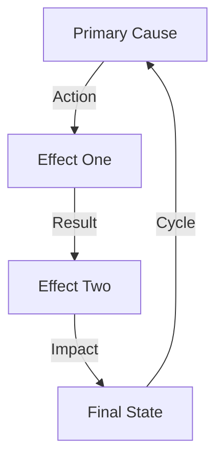

# ANALYSIS TEMPLATE 2.0

## Pattern Map


## Impact Matrix
```
REALITY GRID
┌─────────────┬──────────────┬─────────────┐
│   CLAIM     │  REALITY     │   IMPACT    │
├─────────────┼──────────────┼─────────────┤
│ Their Claim │ Our Reality  │ Their Loss  │
│ Their Myth  │ Our Truth    │ Their Fall  │
│ Their Fear  │ Our Courage  │ Their End   │
└─────────────┴──────────────┴─────────────┘
```

## Core Components
1. **Primary Analysis**
   ```
   BREAK CHAIN
   ├── Theory Break
   ├── Reality Show
   ├── System Expose
   └── Truth Win
   ```

2. **Reality Check**
   ```
   TRUTH GRID
   ├── Evidence One
   ├── Evidence Two
   ├── Evidence Three
   └── Victory Path
   ```

3. **Impact Flow**
   ```
   DAMAGE PATH
   ├── Break Point
   ├── Show Truth
   ├── Create Value
   └── Win Battle
   ```

## Break Points
| Component | Reality | Counter |
|-----------|---------|---------|
| Theory | Facts | Truth |
| System | Evidence | Exposure |
| Control | Freedom | Victory |

## Kill Chain
```
VICTORY PATH
┌────────────────────┐
│ 1. Break Theory    │
├────────────────────┤
│ 2. Show Reality    │
├────────────────────┤
│ 3. Expose System   │
├────────────────────┤
│ 4. Win Truth       │
└────────────────────┘
```

## Reality Anchors
1. **Evidence Chain**
   - Real example one
   - Real example two
   - Real example three

2. **System Exposure**
   - Control point one
   - Control point two
   - Control point three

3. **Victory Signs**
   - Truth marker one
   - Truth marker two
   - Truth marker three

## Quick Strike
"Core truth bomb that destroys their narrative using reality and evidence."

## Analysis Checklist
- [ ] Primary Analysis Complete
- [ ] Reality Check Done
- [ ] Impact Flow Created
- [ ] Break Points Identified
- [ ] Kill Chain Planned

## Notes
[Add specific notes about the position being analyzed]

## Counter Paths
[Map out potential counter strategies based on analysis]

## METADATA
- Topic: [TOPIC]
- Date: [DATE]
- Context: [CONTEXT]
- Goal: [GOAL]

## 1. CORE POSITION
### Main Argument
[Your central thesis in one clear sentence]

### Key Points
1. [Point 1]
2. [Point 2]
3. [Point 3]

### Evidence Base
- Facts: [List key facts]
- Data: [Relevant statistics]
- Sources: [Credible references]

## 2. OPPOSITION MAPPING
### Their Position
[Main opposing argument]

### Core Arguments
1. [Their Point 1]
2. [Their Point 2]
3. [Their Point 3]

### Hidden Assumptions
- [Assumption 1]
- [Assumption 2]
- [Assumption 3]

## 3. BATTLEFIELD ANALYSIS
### Strong Points
- [Your strongest arguments]
- [Why they're effective]

### Weak Points
- [Potential vulnerabilities]
- [How to defend them]

### Neutral Ground
- [Areas of potential agreement]
- [Bridge-building points]

## 4. STRATEGIC APPROACH
### Opening Move
[How to start strong]

### Key Defenses
- [Against Attack 1]
- [Against Attack 2]

### Winning Angles
1. [Primary path to victory]
2. [Secondary approaches]

## 5. AUTHENTICITY ANCHORS
### Personal Experience
[Relevant personal context]

### Genuine Beliefs
[Core principles at stake]

### Relatable Examples
[Stories that illustrate points]

## 6. QUANTUM ADVANTAGES
### Unexpected Connections
[Novel linkages]

### Pattern Breaks
[Where to disrupt expectations]

### Reality Shifts
[Paradigm-changing moments]

## POST-ANALYSIS
### What Worked
[After debate analysis]

### What to Improve
[Learning points]

### Next Steps
[Future preparations]

Remember: Reality beats narrative, truth beats control.
