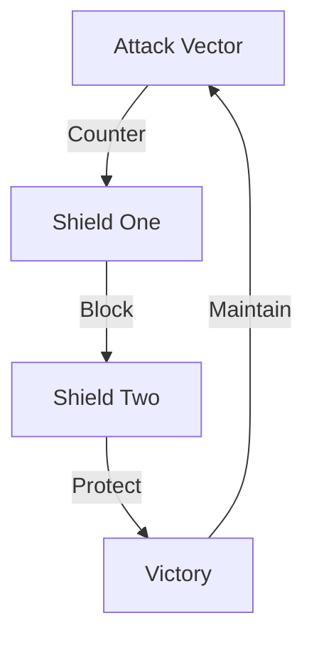

# DEFENSE TEMPLATE 2.0

## Defense Map


## Counter Matrix
```
SHIELD GRID
┌─────────────┬──────────────┬─────────────┐
│   ATTACK    │  COUNTER     │   RESULT    │
├─────────────┼──────────────┼─────────────┤
│ Their Hit   │ Our Block    │ Their Loss  │
│ Their Move  │ Our Counter  │ Their Fall  │
│ Their Push  │ Our Win      │ Their End   │
└─────────────┴──────────────┴─────────────┘
```

## Defense Components
1. **Primary Shields**
   ```
   SHIELD CHAIN
   ├── Truth Shield
   ├── Reality Shield
   ├── Value Shield
   └── Victory Shield
   ```

2. **Counter Attacks**
   ```
   STRIKE GRID
   ├── Truth Strike
   ├── Reality Strike
   ├── Value Strike
   └── Victory Strike
   ```

3. **Victory Path**
   ```
   WIN FLOW
   ├── Block Attack
   ├── Show Truth
   ├── Create Value
   └── Win Battle
   ```

## Break Points
| Attack | Counter | Victory |
|-----------|---------|---------|
| Emotion | Reality | Truth |
| Control | Freedom | Choice |
| Fear | Courage | Win |

## Counter Strategy
```
DEFENSE PATH
┌────────────────────┐
│ 1. Block Attack    │
├────────────────────┤
│ 2. Show Truth      │
├────────────────────┤
│ 3. Create Value    │
├────────────────────┤
│ 4. Win Battle      │
└────────────────────┘
```

## Reality Anchors
1. **Truth Shields**
   - Evidence one
   - Evidence two
   - Evidence three

2. **Counter Weapons**
   - Reality one
   - Reality two
   - Reality three

3. **Victory Signs**
   - Win sign one
   - Win sign two
   - Win sign three

## Quick Defense
"Core counter that turns their attack into our victory using truth and evidence."

Remember: Defense enables victory, truth ensures success.
