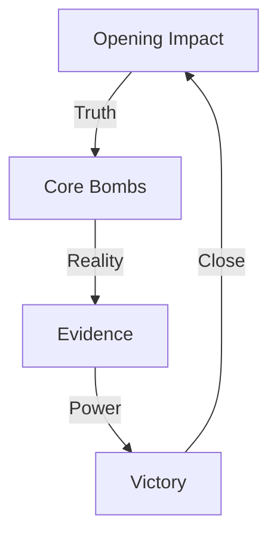

# SPEECH TEMPLATE 2.0

## Speech Flow


## Impact Matrix
```
IMPACT GRID
┌─────────────┬──────────────┬─────────────┐
│   CLAIM     │  REALITY     │   VICTORY   │
├─────────────┼──────────────┼─────────────┤
│ Their Lie   │ Our Truth    │ Their Loss  │
│ Their Myth  │ Our Facts    │ Their Fall  │
│ Their Fear  │ Our Courage  │ Total Win   │
└─────────────┴──────────────┴─────────────┘
```

## Speech Components
1. **Opening Impact**
   "Core truth bomb that sets the stage for victory."

2. **Core Truth Bombs**
   1. **Theory Break**
      "Reality bomb that destroys their narrative."
   2. **System Exposure**
      "Evidence bomb that exposes their control."
   3. **Value Creation**
      "Solution bomb that shows our path."
   4. **Victory Close**
      "Kill shot that ensures our win."

3. **Reality Anchors**
   1. **Evidence Chain**
      ```
      PROOF FLOW
      ├── Hard Fact One
      ├── Hard Fact Two
      ├── Hard Fact Three
      └── Victory Point
      ```
   2. **System Exposure**
      ```
      TRUTH GRID
      ├── Control Point
      ├── Profit Point
      ├── Power Point
      └── Break Point
      ```
   3. **Solution Path**
      ```
      WIN FLOW
      ├── Value Point
      ├── Truth Point
      ├── Reality Point
      └── Victory Point
      ```

## Delivery Checklist
- [ ] Opening Impact Ready
- [ ] Evidence Prepared
- [ ] Logic Chain Built
- [ ] Kill Shot Loaded
- [ ] Reality Anchors Set

## Quick Reference
| Phase | Purpose | Impact |
|-------|----------|--------|
| Open | Hook & Frame | Attention Lock |
| Build | Evidence & Logic | Reality Ground |
| Close | Truth & Victory | Mind Change |

## Energy Points
- Pause after truth bombs
- Emphasis on evidence
- Power on solutions
- Victory in voice

## Reality Anchors
[List concrete examples and proofs]

## Kill Chain
1. **Truth Strike**
   ```
   ATTACK FLOW
   ├── Break Theory
   ├── Show Reality
   ├── Create Value
   └── Win Battle
   ```
2. **Reality Strike**
   ```
   EVIDENCE FLOW
   ├── Hard Fact One
   ├── Hard Fact Two
   ├── Hard Fact Three
   └── Victory Point
   ```
3. **Victory Strike**
   ```
   WIN FLOW
   ├── Truth Point
   ├── Reality Point
   ├── Value Point
   └── Total Win
   ```

## Notes
- Keep energy high
- Stay reality-focused
- Execute with precision
- Land with power

Remember: Speech delivers truth, truth delivers victory.
