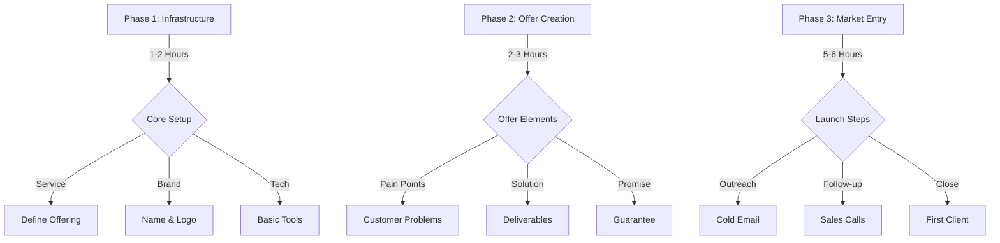

# 10-Hour Service Launch Framework

## Quick-Start Flow

## Implementation Guide

### Hour 1-2: Infrastructure
- [ ] Define proven service
- [ ] Create business name
- [ ] Setup basic tools
- [ ] Draft core offer

### Hour 3-4: Offer Creation
- [ ] Research pain points
- [ ] Define deliverables
- [ ] Create guarantee
- [ ] Set pricing

### Hour 5-10: Market Entry
- [ ] Build target list
- [ ] Create outreach
- [ ] Begin contact
- [ ] Close first deal

## Success Formula
1. Proven Service Selection
   - Existing demand
   - Clear value
   - Quick delivery

2. Clear Outcomes
   - Specific results
   - Timeframe
   - Metrics

3. Risk Reversal
   - Strong guarantee
   - Easy entry
   - Clear exit

## Tools Stack
1. Setup Tools
   - Canva (Logo)
   - Domain registrar
   - Basic website

2. Delivery Tools
   - Project management
   - Communication
   - Delivery system

3. Sales Tools
   - CRM (basic)
   - Calendar
   - Proposals
