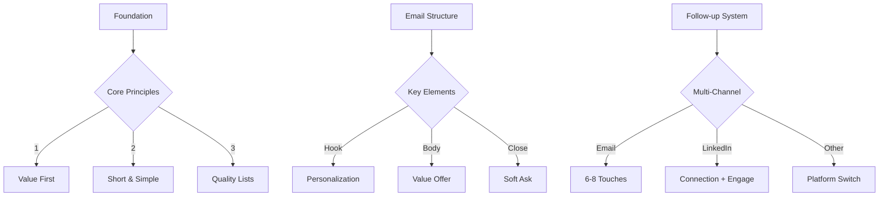

# Cold Email Success Framework

## Core Framework


## Email Templates

### Template 1: Quick Win
```
Subject: Quick win for [Company Name]'s [Specific Area]

Hi [Name],

I noticed [Company] recently [specific observation].

We helped [similar company] achieve [specific result] in [timeframe] using [unique method].

Would you like me to send over a quick video showing how this could work for [Company]?

Best,
[Your Name]
```

### Template 2: Value Share
```
Subject: [Industry] insight for [Company Name]

Hi [Name],

Saw your recent [post/update/news] about [topic].

We just published research showing [relevant insight] that could impact your [specific area].

Happy to share the full report if you're interested.

Best,
[Your Name]
```

## Follow-up Sequence

### Day 1-3
1. Initial Email
2. LinkedIn Connection
3. Value Share

### Day 4-7
4. Follow-up Email
5. LinkedIn Engagement
6. Resource Share

### Day 8-14
7. Final Value Offer
8. Platform Switch

## Tools Stack

### Email Tools
- Instantly
- MailReef
- SmartLead

### Research Tools
- LinkedIn Sales Navigator
- Keywords Everywhere
- ChatGPT

### Follow-up Tools
- CRM
- Calendar
- Video messaging

## Success Metrics

### Response Rates
- Cold Email: 5-15%
- LinkedIn: 20-30%
- Follow-ups: 40-50%

### Conversion Goals
- Discovery Calls: 25%
- Client Conversion: 20%
- Deal Close: 10%
