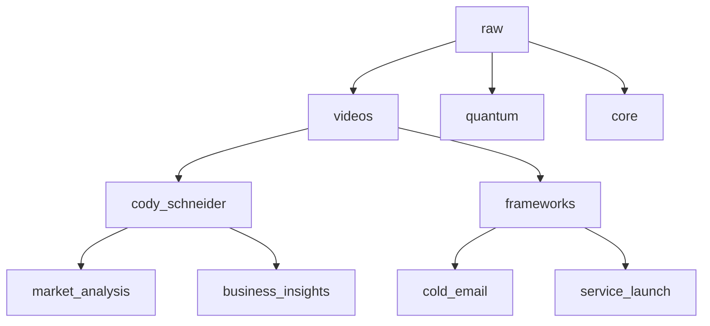

# Raw Knowledge Repository

This directory contains unprocessed or raw knowledge that can be refined into frameworks, formulas, and playbooks.

## Structure

## Directory Purpose

### /videos
Contains raw video transcripts and initial analysis, organized by:
- Source (creator/channel)
- Topic (frameworks, business, etc.)
- Analysis documents

### /quantum
Raw quantum-related knowledge and insights that can be processed into:
- Frameworks
- Algorithms
- Implementation guides

### /core
Fundamental knowledge that forms the basis for:
- System architecture
- Core principles
- Base implementations

## Usage Guide

1. **Adding New Content**
   - Place in appropriate subdirectory
   - Include source information
   - Add brief context

2. **Processing Content**
   - Review raw material
   - Extract key insights
   - Create framework drafts
   - Move to appropriate module

3. **Maintenance**
   - Regular review of content
   - Update outdated information
   - Archive processed material
