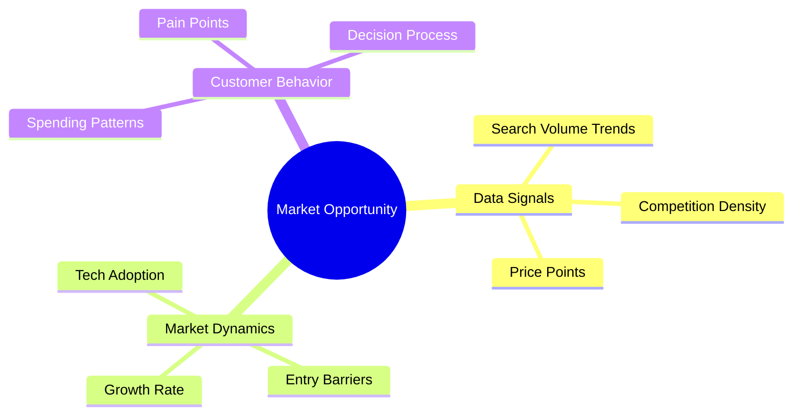
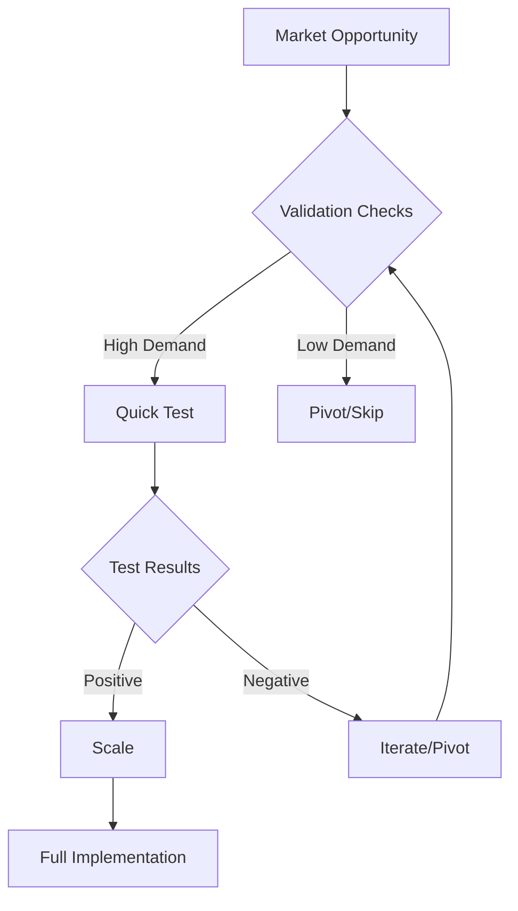

# LAGOS Market Analysis Framework

## Wave-Spotting Protocol

### 1. Data Pipeline Setup
- Supermetrics for data aggregation
- Keywords Everywhere for demand validation
- SEMrush for opportunity analysis

### 2. Market Indicators

### 3. Validation Framework
1. **Data Collection**
   - Search trends
   - Competition analysis
   - Price sensitivity

2. **Quick Testing**
   - Minimum viable offer
   - Value proposition testing
   - Market response measurement

3. **Scale Decision**
   - Response metrics
   - Cost of acquisition
   - Market size validation

## Implementation Guide

### Daily Tasks
1. Monitor market signals
2. Track competitor moves
3. Document customer feedback

### Weekly Analysis
1. Review data pipelines
2. Update opportunity map
3. Adjust strategy based on signals

### Monthly Review
1. Evaluate market position
2. Assess growth opportunities
3. Plan strategic pivots

## Tools Integration
- **Supermetrics**: Data aggregation and visualization
- **Keywords Everywhere**: Market demand validation
- **SEMrush**: Competitive landscape analysis
- **ChatGPT**: Quick market research and validation

## Decision Matrix

