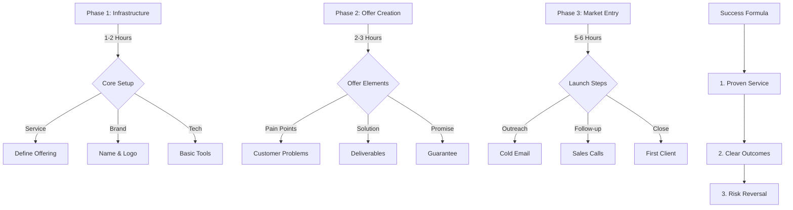
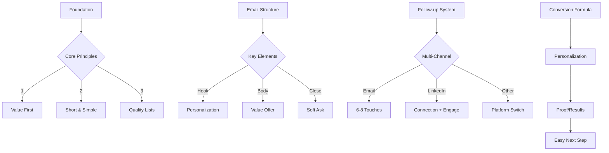
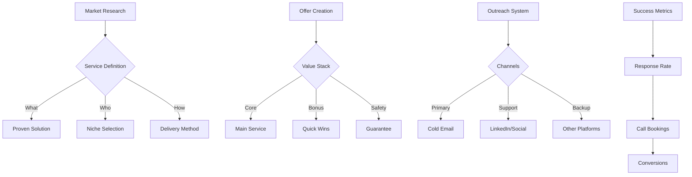

# Service Business Frameworks & Formulas

## 1. 10-Hour Service Launch Framework


## 2. Cold Email Success Framework


## 3. Combined Quick-Start Formula


## 4. Implementation Checklist

### Day 1 (0-4 Hours)
- [ ] Define proven service
- [ ] Create business name
- [ ] Setup basic tools
- [ ] Draft core offer

### Day 1 (4-8 Hours)
- [ ] Build target list
- [ ] Create email templates
- [ ] Setup tracking system
- [ ] Begin outreach

### Day 1 (8-10 Hours)
- [ ] Follow up with responses
- [ ] Book discovery calls
- [ ] Close first client
- [ ] Document process

## 5. Value-First Email Templates

### Template 1: Quick Win Offer
```
Subject: Quick win for [Company Name]'s [Specific Area]

Hi [Name],

I noticed [Company] recently [specific observation].

We helped [similar company] achieve [specific result] in [timeframe] using [unique method].

Would you like me to send over a quick video showing how this could work for [Company]?

Best,
[Your Name]
```

### Template 2: Insight Share
```
Subject: [Industry] insight for [Company Name]

Hi [Name],

Saw your recent [post/update/news] about [topic].

We just published research showing [relevant insight] that could impact your [specific area].

Happy to share the full report if you're interested.

Best,
[Your Name]
```

## 6. Key Success Metrics

### Response Rates
- Cold Email: 5-15% response rate
- LinkedIn: 20-30% connection rate
- Follow-ups: 40-50% of total responses

### Conversion Goals
- Discovery Calls: 25% of responses
- Client Conversion: 20% of calls
- First Client: Within 10 hours

## 7. Tools Stack

### Essential Tools
1. Email Platform
   - Instantly
   - MailReef
   - SmartLead

2. Research Tools
   - LinkedIn Sales Navigator
   - Keywords Everywhere
   - ChatGPT

3. Follow-up Tools
   - CRM (basic)
   - Calendar booking
   - Video messaging

## 8. Risk Mitigation Formula

### Risk = (Market Risk × Execution Risk) ÷ Proof Elements

1. Market Risk Reducers:
   - Proven service offering
   - Existing demand
   - Clear competition

2. Execution Risk Reducers:
   - Simple delivery
   - Clear processes
   - Quick implementation

3. Proof Elements:
   - Case studies
   - Testimonials
   - Results data
